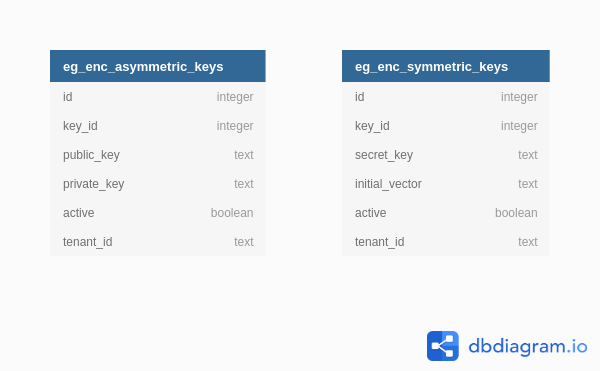

# eGov Encryption Service

Encryption Service is used to secure the data. It provides functionality to encrypt and decrypt data

### DB UML Diagram

### Service Dependencies

- egov-mdms-service

### Swagger API Contract

http://editor.swagger.io/?url=https://raw.githubusercontent.com/egovernments/core-services/gopesh67-patch-8/docs/enc-service-contract.yml#!/

## Service Details

Encryption Service offers following features :

- Encrypt - The service will encrypt the data based on given input parameters and data to be encrypted. The encrypted data will be mandatorily of type string.
- Decrypt - The decryption will happen solely based on the input data (any extra parameters are not required). The encrypted data will have identity of the key used at the time of encryption, the same key will be used for decryption.
- Sign - Encryption Service can hash and sign the data which can be used as unique identifier of the data. This can also be used for searching gicen value from a datastore.
- Verify - Based on the input sign and the claim, it can verify if the the given sign is correct for the provided claim.
- Rotate Key - Encryption Service supports changing the key used for encryption. The old key will still remain with the service which will be used to decrypt old data. All the new data will be encrypted by the new key.

#### Configurations

Following are the properties in application.properties file in egov-enc-service which are configurable.

| Property                     |  Default Value    | Remarks                                                                                                                      | 
| -----------------------------| ------------------| -----------------------------------------------------------------------------------------------------------------------------|
| `master-password`            | asd@#$@$!132123   | Master password for encryption/ decryption.                                                                                  |
| `master.salt`                | qweasdzx          | A salt is random data that is used as an additional input to a one-way function that hashes data, a password or passphrase.  |
| `master.initialvector`       | qweasdzxqwea      | An initialization vector is a fixed-size input to a cryptographic primitive.                                                 |
| `size.key.symmetric`         | 256               | Default size of Symmetric key.                                                                                               |          
| `size.key.asymmetric`        | 1024              | Default size of Asymmetric key.                                                                                              |      
| `size.initialvector`         | 12                | Default size of Initial vector.                                                                                              |

### API Details

a) `POST /crypto/v1/_encrypt`

Encrypts the given input value/s OR values of the object.

b) `POST /crypto/v1/_decrypt`

Decrypts the given input value/s OR values of the object.

c) `/crypto/v1/_sign`

Provide signature for a given value.

d) `POST /crypto/v1/_verify`

Check if the signature is correct for the provided value.

e) `POST /crypto/v1/_rotatekey`

Deactivate the keys for the given tenant and generate new keys. It will deactivate both symmetric and asymmetric keys for the provided tenant.

### Kafka Consumers
NA

### Kafka Producers
NA
