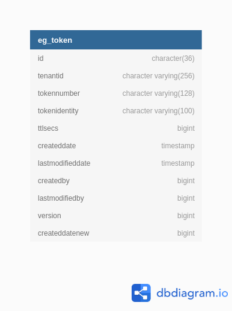

# egov-otp Service

OTP Service is a core service that is available on the DIGIT platform.  The service is used to authenticate the user in the platform.
The functionality is exposed via REST API.

### DB UML Diagram

### Service Dependencies

- NA

### Swagger API Contract

Link to the swagger API contract yaml and editor link like below

http://editor.swagger.io/?url=https://raw.githubusercontent.com/egovernments/egov-services/master/docs/egov-otp/contract/v1-0-0.yml#!/

## Service Details

egov-otp is being called internally by user-otp service which fetches mobileNumber and feeds to egov-otp to generate 'n' digit OTP. 

### API Details

`BasePath` /egov-otp/v1

Egov-otp service APIs - contains create, validate and search end point

a) `POST /otp/v1/_create`   - create OTP Configuration this API is internal call from v1/_send end point, this end point present in user-otp service no need of explicity call

b) `POST /otp/v1/_validate` - validate OTP Configuration this end point is validate the otp respect to mobilenumber

c) `POST /otp/v1/_search`   - search the mobile number and otp using uuid ,uuid nothing but otp reference number

### Property Dependencies

Below properties define the OTP configurations 

a)  `egov.otp.length`  : Number of digits in the OTP 

b)  `egov.otp.ttl`     : Controls the validity time frame of the otp. Default value is 900 seconds. Another OTP generated within this time frame is also allowed. 

c)  `egov.otp.encrypt` : Controls if the otp is encrypted and stored in the table.

### Kafka Consumers

- NA

### Kafka Producers

- NA
