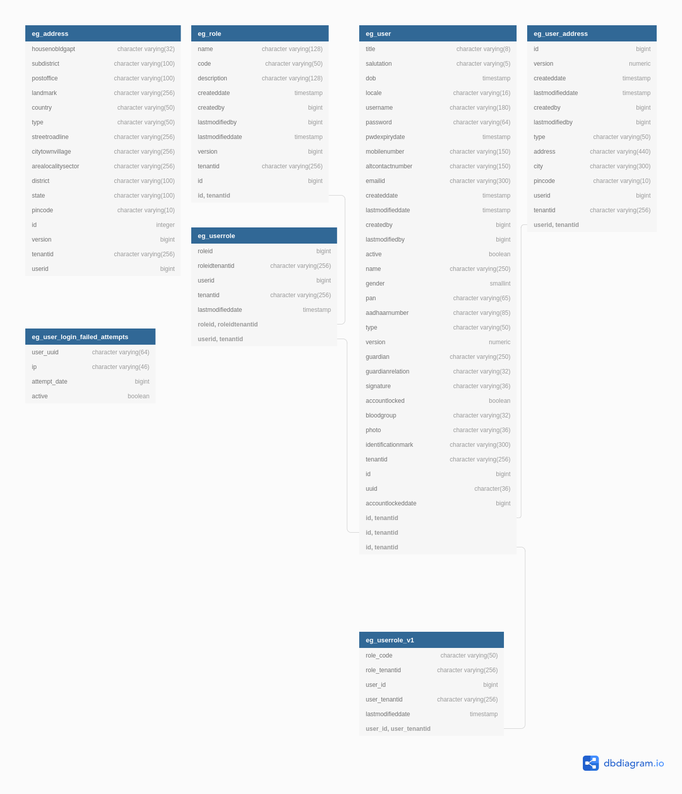

# Egov-user service

<p>Egov-user service is used for user data management and providing functionality to login and logout into Digit system </p>

### DB UML Diagram

- 

### Service Dependencies

- egov-mdms-service
- egov-enc-service
- egov-otp
- egov-filestore


### Swagger API Contract

http://editor.swagger.io/?url=https://raw.githubusercontent.com/egovernments/egov-services/master/docs/egov-user/contracts/v1-1-0.yml#!/

## Service Details

Feature List:
- Employee:
  - User registration
  - Search user
  - Update user details
  - Forgot password
  - Change password
  - User role mapping(Single ulb to  multiple role)
  - Enable employee to login into DIGIT system based on password.

- Citizen:
  - Create user
  - Update user
  - Search user
  - User registration using OTP
  - OTP based login


#### Configurations
NA

### API Details


a) `POST /citizen/_create`

Create citizen with otp validation. If `citizen.registration.withlogin.enabled` property in applications.properties is `true` then created citizen would be logged in automatically and he
would get information to access platform services, ex:- auth token, refresh token etc.

b) `POST /users/_createnovalidate`

Create user without any otp validation.

c) `POST /_search`

End-point to search the users by providing userSearchRequest. In Request if there is no active filed value, it will fetch only active users.
The available search parameters are more in interservice call as compared to call coming externally.

d) `POST /v1/_search`

Similar to `/_search` endpoint except there is no default value provided for search active/inactive users.

e) `POST /_details`

End-point to fetch the user details by access-token

f) `POST /users/_updatenovalidate`

End-point to update the user details without otp validations. User's username, type and tenantId are not updated and ignored in update.

g) `POST /profile/_update`

End-point to update user profile. This allows partial update on user's account.

h) `POST /password/_update`

End-point to update the password for loggedInUser. The existing password is validated before updating new password.

i) `POST /password/nologin/_update`

End-point to update the password for non logged in user. The otp is validated before updating new password.

j) `POST /_logout`

Endpoint to logout session

k) `POST /user/oauth/token`

Endpoint for login. If the user is citizen the login is otp based else it is password based.


### Kafka Consumers
NA

### Kafka Producers
- ```audit_data``` : used in ```kafka.topic.audit``` application property, user service uses this topic for logging user data decryption calls.
